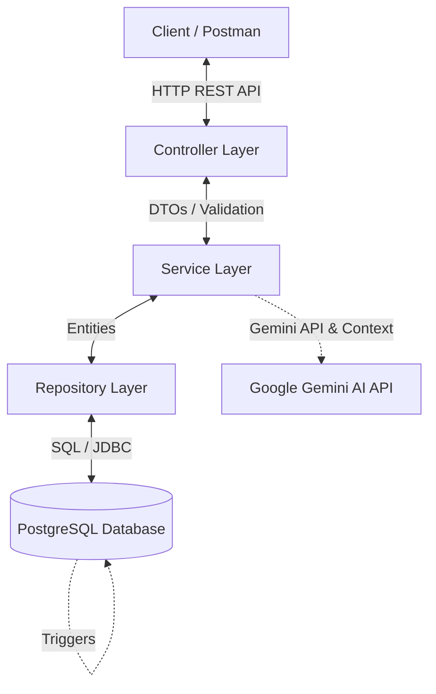
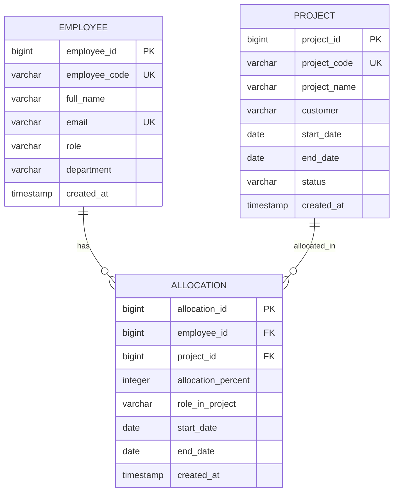

# Solution Document - Resource Allocation Management System

Tài liệu này đặc tả giải pháp kỹ thuật chi tiết cho Hệ thống Quản lý Phân bổ Nhân sự (Resource Allocation Management System) dành cho công ty outsourcing. Hệ thống được thiết kế nhằm giúp Resource Manager/PM tối ưu hóa việc phân bổ nhân lực vào các dự án song song, đảm bảo không quá tải và dễ dàng theo dõi hiệu suất sử dụng nhân sự.

---

## 1. Kiến trúc Tổng thể (System Architecture)

Hệ thống được xây dựng trên nền tảng **Java 17**, **Spring Boot 3.x**, và **PostgreSQL**, tuân thủ mô hình phân lớp chuẩn **Controller - Service - Repository** (3-tier Architecture) nhằm đảm bảo nguyên tắc SOLID và dễ dàng mở rộng, bảo trì:



- **Controller Layer**: Tiếp nhận các request HTTP, thực hiện validation cơ bản thông qua Jakarta Validation annotations (như `@NotBlank`, `@Email`, `@Min`, `@Max`), chuyển đổi dữ liệu sang DTOs và gọi Service.
- **Service Layer**: Nơi xử lý toàn bộ các quy tắc nghiệp vụ (Business Rules). Tầng này độc lập hoàn toàn với giao thức truyền thông (HTTP/REST) để dễ dàng viết Unit Test.
- **Repository Layer**: Kế thừa Spring Data JPA để thực hiện các thao tác CRUD và các câu truy vấn báo cáo phức tạp (JPQL hoặc Native SQL).
- **Database Layer**: Sử dụng PostgreSQL kết hợp các Trigger để đảm bảo tính toàn vẹn dữ liệu ở mức thấp nhất, phòng ngừa lỗi xảy ra từ các tác vụ ghi đồng thời hoặc thao tác ngoài ứng dụng.

---

## 2. Thiết kế Cơ sở Dữ liệu (Database Design)

### Sơ đồ Quan hệ Thực thể (Entity-Relationship Diagram - ERD)



### Các Bảng và Ràng buộc Chi tiết

#### Bảng 1: `employee` (Thông tin nhân viên)
- `employee_id` (BIGSERIAL, PRIMARY KEY): Khóa chính tự tăng.
- `employee_code` (VARCHAR(20), UNIQUE, NOT NULL): Mã nhân viên (ví dụ: EMP001).
- `full_name` (VARCHAR(100), NOT NULL): Họ và tên nhân viên.
- `email` (VARCHAR(255), UNIQUE, NOT NULL): Địa chỉ email liên lạc.
- `role` (VARCHAR(50), NOT NULL): Vai trò chuyên môn chính (ví dụ: Senior Developer, QA Engineer).
- `department` (VARCHAR(50), NOT NULL): Phòng ban/Bộ phận làm việc (ví dụ: FSOFT-Q1).
- `created_at` (TIMESTAMP, DEFAULT CURRENT_TIMESTAMP, NOT NULL): Thời gian tạo bản ghi.

#### Bảng 2: `project` (Thông tin dự án)
- `project_id` (BIGSERIAL, PRIMARY KEY): Khóa chính tự tăng.
- `project_code` (VARCHAR(20), UNIQUE, NOT NULL): Mã dự án (ví dụ: NCG).
- `project_name` (VARCHAR(200), NOT NULL): Tên dự án.
- `customer` (VARCHAR(100)): Tên khách hàng đối tác.
- `start_date` (DATE, NOT NULL): Ngày bắt đầu dự án.
- `end_date` (DATE): Ngày kết thúc dự án (có thể NULL nếu là dự án dài hạn/chưa xác định).
- `status` (VARCHAR(20), NOT NULL): Trạng thái dự án, bị ràng buộc bởi `CHECK (status IN ('PLANNING', 'ACTIVE', 'COMPLETED'))`.
- `created_at` (TIMESTAMP, DEFAULT CURRENT_TIMESTAMP, NOT NULL): Thời gian tạo bản ghi.
- **Ràng buộc**: `ck_project_dates` đảm bảo `start_date <= end_date` nếu `end_date` không NULL.

#### Bảng 3: `allocation` (Chi tiết phân bổ dự án)
- `allocation_id` (BIGSERIAL, PRIMARY KEY): Khóa chính tự tăng.
- `employee_id` (BIGINT, FOREIGN KEY, NOT NULL): Liên kết tới bảng `employee`, tự động xóa nếu nhân viên bị xóa (`ON DELETE CASCADE`).
- `project_id` (BIGINT, FOREIGN KEY, NOT NULL): Liên kết tới bảng `project`, tự động xóa nếu dự án bị xóa (`ON DELETE CASCADE`).
- `allocation_percent` (INTEGER, NOT NULL): Phân trăm thời gian phân bổ. Bị ràng buộc bởi `CHECK (allocation_percent > 0 AND allocation_percent <= 100)`.
- `role_in_project` (VARCHAR(100), NOT NULL): Vai trò cụ thể của nhân viên trong dự án này (ví dụ: Backend Developer).
- `start_date` (DATE, NOT NULL): Ngày bắt đầu phân bổ.
- `end_date` (DATE): Ngày kết thúc phân bổ.
- `created_at` (TIMESTAMP, DEFAULT CURRENT_TIMESTAMP, NOT NULL): Thời gian tạo bản ghi.
- **Ràng buộc**: `ck_allocation_dates` đảm bảo `start_date <= end_date` nếu `end_date` không NULL.

### Tối ưu hóa Database (Indexes)
Nhằm tăng tốc các câu lệnh truy vấn phục vụ báo cáo utilization và tìm kiếm của trợ lý AI, các chỉ mục sau được thiết lập:
- `idx_allocation_employee_id` trên `allocation(employee_id)`: Tối ưu cho việc tính tổng allocation của một nhân viên.
- `idx_allocation_project_id` trên `allocation(project_id)`: Tối ưu cho việc tìm kiếm nhân sự theo dự án.
- `idx_employee_role` trên `employee(role)`: Tối ưu cho AI Recommendation khi tìm kiếm theo vai trò (Role).
- `idx_project_status` trên `project(status)`: Tối ưu hóa việc lọc dự án theo trạng thái.

---

## 3. Giải pháp Nghiệp vụ và Khắc phục Lỗi Trigger

### Business Rule 1 & 3: Ràng buộc Allocation Percent và Project Status
- **Hạn chế mức phân bổ**: Phần trăm của một bản ghi allocation đơn lẻ phải thỏa mãn $0 < allocation\_percent \le 100$. Điều này được kiểm soát bởi cả `@Min(1)` / `@Max(100)` tại DTO đầu vào và `CHECK` constraint tại database.
- **Dự án Completed**: Không cho phép tạo mới hoặc chỉnh sửa allocation nếu dự án đích có trạng thái là `COMPLETED`. Ở tầng Backend, Service sẽ query trạng thái dự án và ném exception nếu vi phạm; ở tầng Database, trigger `trg_check_project_not_completed` sẽ đảm nhận vai trò này để chống can thiệp trực tiếp từ bên ngoài.

### Business Rule 2: Tổng Allocation của Nhân viên Không Vượt Quá 100%
Đây là nghiệp vụ cốt lõi của hệ thống. Chúng tôi triển khai cơ chế phòng thủ 2 lớp (Double-layer Protection):

#### Lớp 1: Validate tại Service Layer (Tầng ứng dụng)
Khi tạo mới hoặc cập nhật một allocation, Service sẽ thực hiện:
1. Truy vấn tổng allocation hiện tại của nhân viên đó trong DB.
2. Với trường hợp **Tạo mới**:
   $$\text{projectedTotal} = \text{currentTotal} + \text{newAllocationPercent}$$
3. Với trường hợp **Cập nhật** (UPDATE):
   $$\text{projectedTotal} = \text{currentTotal} - \text{oldAllocationPercent} + \text{newAllocationPercent}$$
4. Nếu $\text{projectedTotal} > 100$, hệ thống ném ra `AllocationExceededException` (kết quả trả về là HTTP 400 Bad Request).

#### Lớp 2: Kiểm soát tại Database (Tầng PostgreSQL thông qua Trigger)
- **Lỗi logic ở trigger cũ**: Nguyên bản trigger kiểm tra tổng allocation của nhân viên thông qua câu lệnh:
  ```sql
  SELECT COALESCE(SUM(allocation_percent), 0) INTO total_allocation FROM allocation WHERE employee_id = NEW.employee_id;
  ```
  Điều này hoạt động đúng cho thao tác `INSERT`. Tuy nhiên, với thao tác `UPDATE` bản ghi hiện tại, giá trị cũ (`OLD.allocation_percent`) đã tồn tại trong DB và sẽ bị tính cộng vào hàm `SUM`. Khi đó, trigger sẽ tính ra tổng bị đội lên, khiến cho việc cập nhật thông tin (ví dụ: giảm phân bổ từ 50% xuống 30%) bị trigger chặn lại một cách sai lầm.
- **Giải pháp khắc phục**: Cập nhật hàm trigger để phân biệt hoạt động `INSERT` và `UPDATE`. Nếu là `UPDATE`, ta loại bỏ dòng hiện tại ra khỏi phép tính tổng trước khi cộng với giá trị mới:
  ```sql
  CREATE OR REPLACE FUNCTION check_employee_allocation_limit()
  RETURNS TRIGGER AS $$
  DECLARE
      total_allocation INTEGER;
  BEGIN
      IF (TG_OP = 'UPDATE') THEN
          -- Loại trừ dòng đang được cập nhật (OLD.allocation_id)
          SELECT COALESCE(SUM(allocation_percent), 0)
          INTO total_allocation
          FROM allocation
          WHERE employee_id = NEW.employee_id AND allocation_id != OLD.allocation_id;
      ELSE
          SELECT COALESCE(SUM(allocation_percent), 0)
          INTO total_allocation
          FROM allocation
          WHERE employee_id = NEW.employee_id;
      END IF;

      IF total_allocation + NEW.allocation_percent > 100 THEN
          RAISE EXCEPTION 'Employee allocation exceeds 100%%';
      END IF;

      RETURN NEW;
  END;
  $$ LANGUAGE plpgsql;
  ```

---

## 4. Giải pháp cho các API Báo cáo (Reporting Functions)

Để tạo ra các báo cáo nhanh chóng, chúng ta sử dụng các câu lệnh JPQL/SQL tổng hợp (Aggregate Functions) kết hợp với mệnh đề `GROUP BY`.

### 4.1 Employee Utilization Report
- **Mục tiêu**: Hiển thị tổng allocation đang hoạt động của từng nhân viên.
- **JPQL Query** (Repository):
  ```java
  @Query("SELECT new com.resourceallocation.dto.UtilizationReportDTO(e.employeeId, e.fullName, COALESCE(SUM(a.allocationPercent), 0)) " +
         "FROM Employee e LEFT JOIN Allocation a ON e.employeeId = a.employee.employeeId " +
         "GROUP BY e.employeeId, e.fullName")
  List<UtilizationReportDTO> getUtilizationReport();
  ```

### 4.2 Available Resource Report
- **Mục tiêu**: Tìm những nhân viên có tổng allocation < 100% (tức là còn thời gian khả dụng).
- **JPQL Query** (Repository):
  ```java
  @Query("SELECT new com.resourceallocation.dto.AvailableResourceDTO(e.employeeId, e.fullName, e.role, 100 - COALESCE(SUM(a.allocationPercent), 0)) " +
         "FROM Employee e LEFT JOIN Allocation a ON e.employeeId = a.employee.employeeId " +
         "GROUP BY e.employeeId, e.fullName, e.role " +
         "HAVING COALESCE(SUM(a.allocationPercent), 0) < 100")
  List<AvailableResourceDTO> getAvailableResources();
  ```

### 4.3 Overloaded Employee Report
- **Mục tiêu**: Tìm những nhân viên có workload cao (tổng allocation > 90%).
- **JPQL Query** (Repository):
  ```java
  @Query("SELECT new com.resourceallocation.dto.OverloadedResourceDTO(e.employeeId, e.fullName, COALESCE(SUM(a.allocationPercent), 0)) " +
         "FROM Employee e JOIN Allocation a ON e.employeeId = a.employee.employeeId " +
         "GROUP BY e.employeeId, e.fullName " +
         "HAVING SUM(a.allocationPercent) > 90")
  List<OverloadedResourceDTO> getOverloadedEmployees();
  ```

---

## 5. Giải pháp cho Trợ lý AI (RAMS AI Assistant Engine)

Hệ thống được tích hợp trực tiếp với **Google Gemini AI API** thực tế (thay thế hoàn toàn cho cơ chế regex mô phỏng). Trợ lý AI có khả năng đọc hiểu tự nhiên, suy luận ngữ cảnh và đưa ra phản hồi chính xác dựa trên dữ liệu thật của hệ thống nhờ cơ chế **Context Injection**.

### 5.1 Cơ chế Nạp Ngữ Cảnh (Context Injection Flow)
Mỗi khi nhận được câu hỏi từ người dùng, Backend Spring Boot sẽ tự động truy vấn toàn bộ dữ liệu hiện thời trong PostgreSQL để làm dữ liệu nền (Context) cho AI:
1. **Dữ liệu Nhân sự & Workload**: Lấy tên, vai trò và phần trăm khả dụng hiện tại của từng người.
2. **Dữ liệu Dự án**: Lấy thông tin các dự án hiện có (Mã dự án, Tên dự án, Trạng thái, Ngày bắt đầu/kết thúc).
3. **Dữ liệu Phân bổ (Mối liên kết)**: Lấy danh sách chi tiết ai đang làm dự án nào, vai trò gì, tỷ lệ bao nhiêu %.

Cả 3 khối dữ liệu thô này được chuyển thành JSON và đính kèm vào System Instruction gửi lên Gemini API. Do đó, AI có thể trả lời chính xác các câu hỏi liên kết phức tạp.

### 5.2 Giao Thức Phản Hồi Thống Nhất
AI tự động phân tích ý định của người dùng và trả về phản hồi dưới dạng JSON nghiêm ngặt có 3 chế độ (`mode`):
- **`recommend`**: Đề xuất danh sách nhân lực khả dụng phù hợp.
- **`risk`**: Liệt kê các cảnh báo rủi ro quá tải năng lực khi chuẩn bị gán nhân sự cho Sprint/Dự án mới.
- **`text`**: Trả lời bằng ngôn ngữ tự nhiên tiếng Việt cho các câu hỏi thông thường.

---

## 6. Thiết kế Exception Handling và Validations

### Validation đầu vào (DTO Layer)
Sử dụng các annotation của thư viện `jakarta.validation`:
- `EmployeeRequest`: `@NotBlank`, `@Email`, `@Size`
- `ProjectRequest`: `@NotBlank`, `@NotNull`
- `AllocationRequest`: `@NotNull`, `@Min(1)`, `@Max(100)`, `@NotBlank`

### Exception Handler tập trung (`GlobalExceptionHandler`)
Bắt các lỗi nghiệp vụ và lỗi hệ thống để trả về JSON với cấu trúc thống nhất `{"message": "..."}`:
1. `EmployeeNotFoundException` / `ProjectNotFoundException` $\to$ HTTP 404 Not Found.
2. `AllocationExceededException` (vượt quá 100%) $\to$ HTTP 400 Bad Request.
3. `CompletedProjectException` (dự án đã completed) $\to$ HTTP 400 Bad Request.
4. `MethodArgumentNotValidException` (lỗi validation DTO) $\to$ HTTP 400 Bad Request.
5. `Exception` (lỗi hệ thống) $\to$ HTTP 500 Internal Server Error.

---

## 7. Các API Contract Chính

### 7.1 Employee APIs
- **Tạo nhân viên**: `POST /employees`
- **Lấy danh sách**: `GET /employees` (hỗ trợ pagination & sorting)
- **Lấy chi tiết**: `GET /employees/{id}`

### 7.2 Project APIs
- **Tạo dự án**: `POST /projects`
- **Lấy danh sách**: `GET /projects` (hỗ trợ pagination & sorting)
- **Lấy chi tiết**: `GET /projects/{id}`

### 7.3 Allocation APIs
- **Tạo phân bổ**: `POST /allocations`
- **Cập nhật phân bổ**: `PUT /allocations/{id}`
- **Lấy danh sách**: `GET /allocations` (hỗ trợ pagination & sorting)
- **Lấy workload của nhân viên**: `GET /employees/{id}/workload`
  - Response payload:
    ```json
    {
      "employeeId": 1,
      "employeeName": "Tuan Ho Anh",
      "totalAllocation": 80,
      "available": 20
    }
    ```

### 7.4 Report APIs
- **Báo cáo Utilization**: `GET /reports/utilization`
- **Báo cáo Available Resources**: `GET /reports/available`
- **Báo cáo Overloaded Employees**: `GET /reports/overloaded`
- **Báo cáo Idle Employees (0%)**: `GET /reports/idle-employees`
- **Báo cáo Project Member Count**: `GET /reports/project-members`

### 7.5 AI Copilot API
- **Endpoint duy nhất**: `POST /ai/copilot`
  - Request body:
    ```json
    {
      "prompt": "Tìm Java Developer còn tối thiểu 50% available."
    }
    ```
  - Response body (Đề xuất nhân lực):
    ```json
    {
      "mode": "recommend",
      "recommendedResources": [
        {
          "employee": "Nguyen Van Binh",
          "available": 50
        }
      ],
      "text": "Dưới đây là các nhân sự khả dụng tôi gợi ý cho anh:"
    }
    ```
